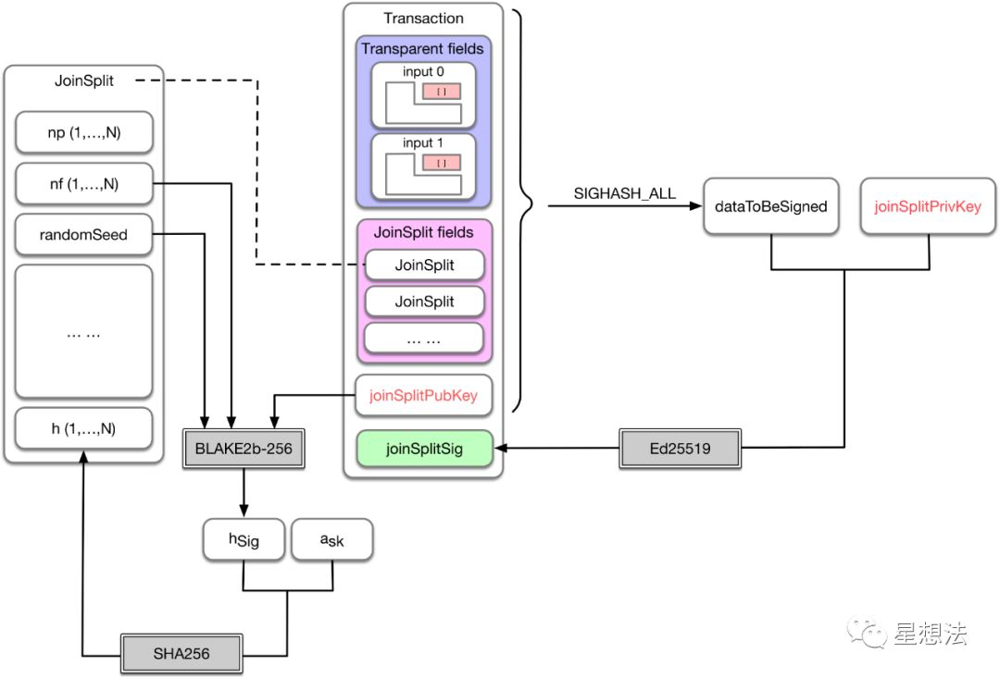

## ZK-BAC Python钱包服务  

### 1.1 功能
Python钱包服务以Django服务框架为基础，使用fisco python sdk与fisco节点交互和使用GRPC与零知识证明计算服务Prover_server交互，
为用户提供账号（包括fisco账号和匿名账号）创建，资产（包括bac token和匿名资产commits）管理，匿名交易，智能合约（包括Bac001合约和Groth16mixer合约）调用和查询交易记录等服务。
其中，匿名交易包括： 
-  将bac token存入到Groth16mixer合约，生成匿名资产commits（一次最多生成两个）；
- 向匿名账号转账（一次最多指定两个匿名账号）；
- 从Groth16mixer合约提取匿名资产为bac token。

此服务提供BAC的匿名转账功能；  
 1 生成ZKBAC地址（匿名转账所需的地址）和fisco地址（公开转账需要）   
 2 存入资产（从fisco地址转移BAC到匿名转账合约地址以生成UTXO到ZKBAC地址），ZKBAC地址获取utxo    
 3 转账  （ZKBAC地址互转，全匿名）  
 4 取出资产  （从ZKBAC地址转移到fisco地址）  

### 1.2 部署

- 环境要求：Python 3.7， gcc，mysql  
#### 1.2.1
 1 拉取代码：  
    git clone https://github.com/yanyanho/zk-client.git  
 2 进入zk-client目录  
    pip install -r requirements.txt 安装相关python库

 3 拷贝fisco节点sdk证书到python_web3/bin目录下     
 4 在./commands/constants.py中配置prover_server，fisco节点，mysql服务器的地址，端口和数据库等信息:
```
FISCO_RPC_ENDPOINT_DEFAULT = http://119.23.46.126:8545（Fisco节点的地址）
PROVER_SERVER_ENDPOINT_DEFAULT = "116.85.72.123:50051"（PROVER_SERVER的地址）
DATABASE_DEFAULT_ADDRESS = "39.108.248.156"（数据库地址）
DATABASE_DEFAULT_PORT = 3306（数据库端口）
DATABASE_DEFAULT_USER = "root"（数据库用户名）
DATABASE_DEFAULT_PASSWORD = "******"（数据库密码）
DATABASE_DEFAULT_DATABASE = "zk_test"（数据库名字）
```
 

 5 创建数据库以及初始化表：  
    create database zk_test（这里的数据库名字与配置文件中的数据库名字DATABASE_DEFAULT_DATABASE一致）  
    use zk_test  
    使用create_tables.sql文件中的sql语句创建表      


 6 数据库初始化完成后：  
  ```
python manage.py runserver 0.0.0.0:5002 
#启动django服务（如果python命令默认是python2，请使用python3命令）  
  ```

### 1.3 原理介绍
 可以参考  
 zkbac采用utxo模型
 针对每笔utxo对应一个commit（即utxo的hash），nullifer为作废的commit。  
 #### 1.3.1 基本概念：
 - 匿名地址：
   每个用户又一个地址
``` 
   0874eff170f7036b7cd4f7a95951d8efd7a42fe831b3bf9a6e4baeb22da6e2b5:ef4485c99d6f719631184c1d57db3658d2c9abfbc46e9be0026e8aadf154af21 
   第一段为apk接受地址  
   第二段为pkenc，用户传输，加密note原文    
    apk The paying key 
    ask The spending key
    pkenc The transmission key
    skenc The receiving key

   ownership_keypair：（apk,ask）
    Returns a_pk = blake2s(1100 || [a_sk]_250 || 0^254)  
```
    
 - zethnote(utxo具体数据结构):  
   ZethNote(apk=apk, value=value, rho=rho, trap_r=r)  
   apk 地址，vlaue 金额  trap_r 随机数，  rho 关联commit 和nullifier
   
 
  - 针对note的commit:
   commit:
    compute_commitment
    inner_k = blake2s(r || a_pk || rho || V)
    
  -  rho:
    Returns rho_i = blake2s(0 || i || 10 || [phi]_252 || hsig）
    
   - 针对commit的nullifier:
    nullifier:
    Returns nf = blake2s(1110 || [a_sk]_252 || rho)
    
   - hsig：关联nullifier和commit
     hsig:
    Compute h_sig = sha256(nf0 || nf1 || sign_vk)
    
  #### 1.3.2 zkclient计算流程：  
        
   以存入资产为例：  
    1 构造outputnote: (apk,value)  
    2 如果input note 输入不够2个 ，构造混淆inputnote， 并计算input zethnote的merkel路径 mkpath:    
    
   ```
    dummy_note = ZethNote(
           apk=ownership_key_as_hex(a_pk),
           value=ZERO_UNITS_HEX,
           rho=get_dummy_rho(),
           trap_r=trap_r_randomness())
   
     // 随机生成一个加密密钥对，用于加密input note原文
    dummy_k_pk = generate_encryption_keypair().k_pk
    dummy_addr_pk = ZethAddressPub(sender_a_pk, dummy_k_pk)
   ```  
 
   3 此时inputnote(apk,value,rho,trap_r) 和 outputnote（apk,value）已经建好。下面开始构造joinsplit 
      产生一次性的签名密钥（schnorr签名）用于签名joinsplit    
    ```
     signing_keypair= signing.gen_signing_keypair()
    ```
      
   4 根据inputnote计算nullifier      
     compute_nullifier：
     Returns nf = poseidon(1010 || [a_sk]_250 || rho)

 ```
    non_zero_a_sk = binary_a_sk[index:]
    a_sk_254 = non_zero_a_sk.zfill(254)
    first_250bits_ask = a_sk_254[:250]
    left_leg_bin = "1010" + first_250bits_ask
```
    
   5 构造JoinsplitInput，数据结构如下：    
    ```
    JoinsplitInput(
    merkle_path=merkle_path,
    address=input_address,
    note=input_note,
    spending_ask=ownership_key_as_hex(a_sk),
    nullifier=input_nullifier0)
    ```
      
   6 计算hsig ，主要防止交易重新被锻造攻击  
    一次性签名密钥的signing_keypair.vk
    Compute h_sig = sha256(nf0 || nf1 || sign_vk)
    
   ```
      h_sig = compute_h_sig_cb(
      input_nullifier0,
      input_nullifier1,
      sign_vk)
   ```
      
   7 生成随机数phi , 用于产生nullifierd的rho。 给output note加上 rho和trap_r
   ```
     phi = _phi_randomness()  32字节随机数  
   ```
  
   8 计算output note的rho， trap_r. 
   ``` 
     Returns rho_i = poseidon(0 || i || 10 || [phi]_250 || hsig)    
     trap_r产生随机数即可.
   ```
   此时output note 的rho和 trap_r 产生好了。

     
   9 产生proofinput发送给prover:
   ```
     ProofInputs(
     mk_roots=merkle_roots,
     js_inputs=js_inputs,
     js_outputs=js_outputs,
     pub_in_value=int64_to_hex(public_in_value_zeth_units),
     pub_out_value=int64_to_hex(public_out_value_zeth_units),
     h_sig=h_sig.hex(),
     phi=phi)
     
   其中 
   js_inputs ： 
   JoinsplitInput(
   merkle_path=merkle_path,
   address=address,
   note=note,
   spending_ask=ownership_key_as_hex(a_sk),
   nullifier=nullifier.hex())
   
   js_output :
   ZethNote(apk,value,rho,trap_r)
 ```  
   10 获取proof后，加密outputnote。 用接收者的k_pk。  
    ``` 
     _encrypt_note ，先ec25519随机产生一对公私钥对， 私钥乘接收者的k_pk(kdf), 计算共享密钥。
      加密后，把临时公钥放在加密消息体头ciphertexts。  
      后续接收者接受event解密ciphertexts。获取outputnote
    ```   
   11 最后对整个joinsplit进行签名： 防止transaction malleability，
     schnorr签名私钥    
     
   ```
     joinsplit_sign(
             signing_keypair: JoinsplitSigKeyPair,
             sender_eth_address: str,
             ciphertexts: List[bytes],
             proof_json: GenericProof,
     ) 
       主要签名 
     - senders Ethereum address   
     - ciphertexts  
     - proof elements   
     - public input elements  
   ```    
  
  12 计算出mixparameter，然后调用  
     
   ```
     mix_params = contracts.MixParameters(
     proof_json,
     signing_keypair.vk,
     signature,
     ciphertexts)
   ```   
    
  
  13 event监听逻辑 , 解析event事件  
   emit LogMix(mid,new_merkle_root,nullifiers,commitments,ciphertexts); 
   
   1 获取commit,更新merkel树  
   2 用自己私钥解密ciphertexts，解出来即自己的note  
   3 计算note的commit  
   inner_k = poseidon(r || a_pk[:94] || rho[:94] || v)  
   检查跟event的commit跟本地算的是否一致  
   4 检查nullifier  
    Returns nf = poseidon(1010 || [a_sk]_250 || rho)  
    将note信息存入note_{username}文件  
  ```  
    {
        "note": {
            "a_pk": "0874eff170f7036b7cd4f7a95951d8efd7a42fe831b3bf9a6e4baeb22da6e2b5",
            "value": "0000000000989680",
            "rho": "2368d3071623cd22ec7b1d8af25e8a4795754e58803123ea815788984c49e248",
            "trap_r": "09f48f0880dd6e7c32a8f637bf76d6eb02beca3122f73258bd8b53c3c6406146"
        },
        "mid": "2",
        "address": "25",
        "commitment": "2489ca939dea145d2ae9ed365a26ed6643ec4a800246fc0b772984270868ba46"
    }
  ```
   5 修改state_{username}文件
  ``` 
     nullifier_map": {
    "11879b2216ef1f7a96e989b0e2a291389c91aa9084213575f8a36d8c9d3e4052": "0517deca"}
   ```
   6 将note文件移动到spent
        
  
   #### 1.3.3 合约部分计算流程：  
  
   主要Groth16Mixer.sol  
   
   构造函数传入zksnark 的verifyKey  
     ```
     constructor(
     uint256 mk_depth,
     address token,
     address poseidonAddress,
     uint256[2] memory Alpha,
     uint256[2] memory Beta1,
     uint256[2] memory Beta2,
     uint256[2] memory Delta1,
     uint256[2] memory Delta2,
     uint256[] memory ABC_coords)
     BaseMixer(mk_depth, token, poseidonAddress)
     ```  
    
   mix函数逻辑 
  
   ```
    mix(
    uint256[2] memory a,
    uint256[4] memory b,
    uint256[2] memory c,
    uint256[4] memory vk,
    uint256 sigma,    
    uint256[nbInputs] memory input,
    bytes[jsOut] memory ciphertexts)
 ```
   1 检验nullifier和 hsig  
   2 schnorr签名内容 joinsplit  
   3 零知识versify  
   4 新commit插入merkel树  
   5 发送事件  
   emit LogMix(
   mid,
   new_merkle_root,
   nullifiers,
   commitments,
   ciphertexts);  
   6 处理公开转账    

 重点input解析
``` 
 // ====================================================================== //
    // Reminder: Remember that the primary inputs are ordered as follows:
    //
    //   [Root, CommitmentS, NullifierS, h_sig, h_iS, Residual Field Element(S)]
    //
    // ie, below is the index mapping of the primary input elements on the
    // protoboard:
    //
    // - Index of the "Root" field elements: {0}
    // - Index of the "CommitmentS" field elements: [1, 1 + NumOutputs[
    // - Index of the "NullifierS" field elements:
    //   [1 + NumOutputs, 1 + NumOutputs + NumInputs[
    // - Index of the "h_sig" field element: {1 + NumOutputs + NumInputs}
    // - Index of the "Message Authentication TagS" (h_i) field elements:
    //   [1 + NumOutputs + NumInputs + 1,
    //    1 + NumOutputs + NumInputs + 1 + NumInputs[
    // - Index of the "Residual Field Element(s)" field elements:
    //   [1 + NumOutputs + NumInputs + 1 + NumInputs,
    //    1 + NumOutputs + NumInputs + 1 + NumInputs + nb_field_residual[
    //
    // The Residual field elements are structured as follows:
    // - v_pub_in [0, public_value_length[
    // - v_pub_out [public_value_length, 2*public_value_length[
    // - h_sig remaining bits
    //   [2*public_value_length,
    //    2*public_value_length + (digest_length-field_capacity)[
    // - nullifierS remaining bits:
    //   [2*public_value_length + (digest_length-field_capacity),
    //    2*public_value_length + (1+NumInputs)*(digest_length-field_capacity)[
    // - message authentication tagS remaining bits:
    //   [2*public_value_length + (1+NumInputs)*(digest_length-field_capacity),
    //    2*public_value_length + (1+2*NumInputs)*(digest_length-field_capacity)]
    // ============================================================================================ //
```
